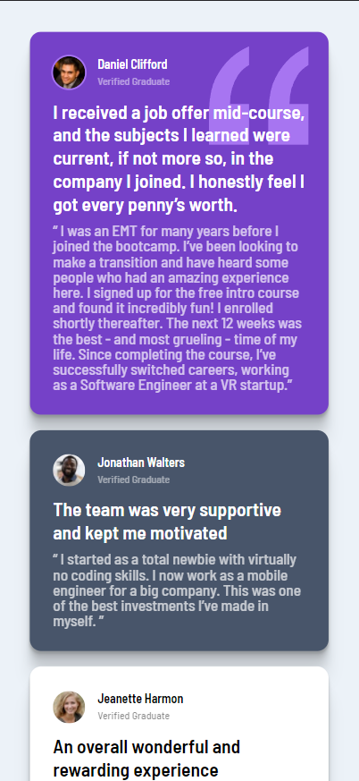
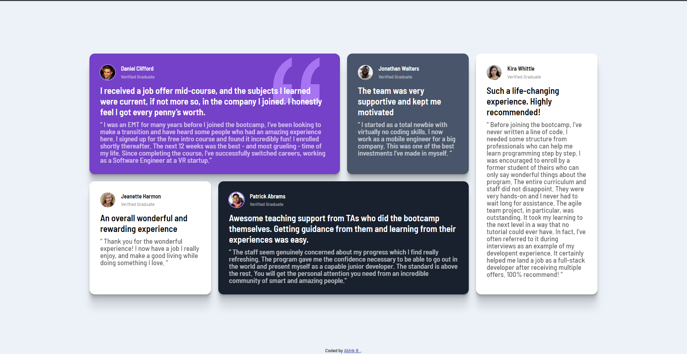

# Frontend Mentor - Testimonials grid section solution

This is a solution to the [Testimonials grid section challenge on Frontend Mentor](https://www.frontendmentor.io/challenges/testimonials-grid-section-Nnw6J7Un7). Frontend Mentor challenges help you improve your coding skills by building realistic projects.

## Table of contents

- [Overview](#overview)
  - [The challenge](#the-challenge)
  - [Screenshot](#screenshot)
  - [Links](#links)
- [My process](#my-process)
  - [Built with](#built-with)
  - [Useful resources](#useful-resources)
- [Author](#author)

## Overview

### The challenge

Users should be able to:

- View the optimal layout for the site depending on their device's screen size

### Screenshots

### Links

- Solution URL: [My Solution](https://www.frontendmentor.io/solutions/responsive-testimonials-grid-with-staggering-animations-FUdLAgbilC)
- Live Site URL: [Abhik B | Testimonial Grid Section](https://abhik-b.github.io/testimonial-grid-section-fm/)

## My process

### Built with

- Semantic HTML5 markup
- Plain CSS
- Flexbox
- CSS Grid
- Mobile-first workflow

### Useful resources

- [Kevin Powell's Vidoe](https://www.youtube.com/watch?v=rg7Fvvl3taU) - This vidoe helped me for making responsive CSS GRID. I really liked his explanation.
- [Box Shadow Tricks](https://www.makeuseof.com/css-box-shadow-tricks-examples/) - This is an amazing article which helped me creating `box-shadow`.

## Author

- Youtube - [Abhik B](https://www.youtube.com/c/abhikb/videos)
- Frontend Mentor - [@abhik-b](https://www.frontendmentor.io/profile/abhik-b)
- Twitter - [@\_abhikB](https://www.twitter.com/_abhikB)
